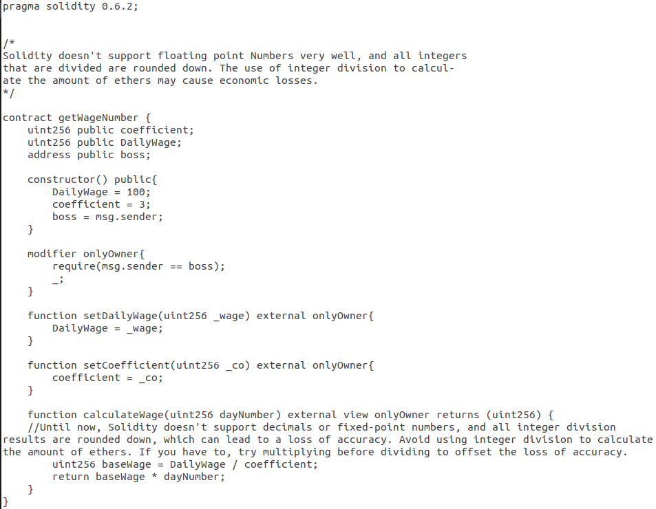
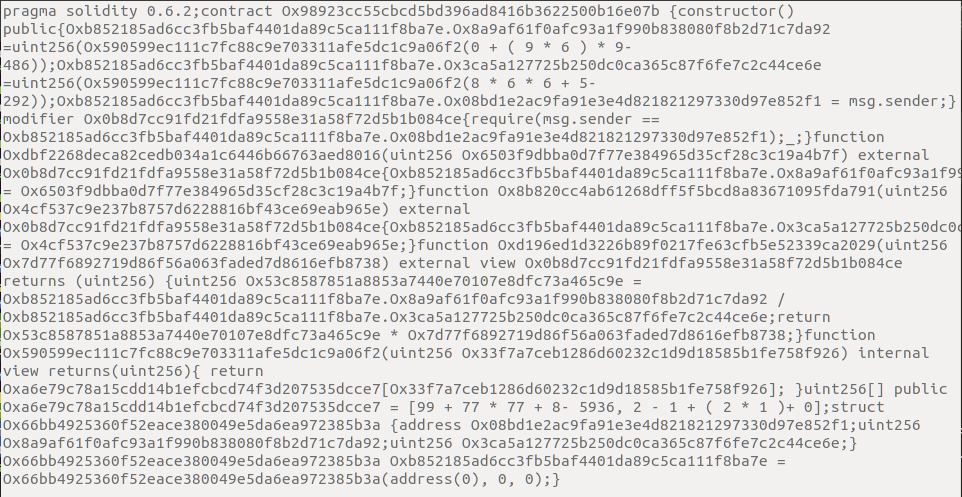

# BiAn(狴犴)


**BiAn** is a source code level code obfuscation tool developed for Solidity smart contracts. We will obfuscate the Solidity smart contract from the following three aspects:
+ **Layout obfuscation**. 
+ **Data flow obfuscation**. 
+ **Control flow obfuscation**. This aspect will be developed by the project collaborator *ZhangMeng*.

## Usage
Enter the following instruction in the terminal (eg., ubuntu os):
```
git clone https://github.com/xf97/BiAn
cd BiAn/src
python main.py yourContract.sol yourContract.sol's_json.ast
```
and you're done.

## Feature completion status
Feature completed:
+ **Layout obfuscation**:
    1. *Delete comments*.
    2. *Disrupt the formatting*.
    3. *Replace variable's name*.
+ **Data flow obfuscation**.
    1. *Convert local variables to state variables*. This feature is turned off by default, because changing local variables to state variables in *Solidity* may cause compile error in the *pure* or *view* function. User can manually modify the configuration file to turn up this feature.
    2. *Dynamically generate static data*.
    3. *Convert integer literals to arithmetic expressions*.
    4. *Split boolean variables*.
    5. *Scalar to vector*.

The configuration file (*Configuration.json*) is a json file, and users can turn on or off various functions by modifying this file.

The following features' development has been stopped due to current restrictions. Uncompleted features:
+ **Data flow obfuscation**.
    1. *Collapse and merge arrays*.
    2. *Split functions and contracts*.

## An example
Use **BiAn** (default configuration) to obfuscate the following contract.
Before obfuscation:


After confuscation:


The obfuscated contract can still be compiled (no errors or warnings).

## Possible use 
We hope that **BiAn** can play a role in the following aspects:
+ Enhance bug smart contracts.
+ Protect the contract source code.

## Open source code used in **BiAn**
In the *Convert Integer Literals to Arithmetic Expressions* and *Split boolean variables* function, I use the code from project *Auto-Generate-Expression* (contributed by @threeworld et al). Since our requirements do not exactly match the project *Auto-Generate-Expression*'s function, I rewrite some code.

## License
This program is issued, reproduced or used under the permission of **MIT**. Please indicate the source when using.
